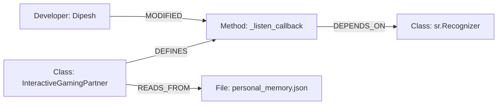

# 🕉️ Saarthika: JARVIS-Level Evolution & Cognitive Reasoning Blueprint

Saarthika is already a remarkable strategic AI companion featuring a robust dual-brain architecture, Hinglish conversational voice capabilities, and an integrated Reinforcement Learning logging pipeline. To elevate Saarthika from a reactive strategic shadow to a **Tony Stark JARVIS-level** omnipresent companion, we must bridge the gap between static polling and continuous ambient perception, intelligence, and execution.

This document serves as a comprehensive architectural blueprint, technical specification, and development roadmap to transform Saarthika into an immersive, self-evolving, agentic companion with state-of-the-art cognitive reasoning.

---

## 🏗️ The 6 Pillars of JARVIS-Level AI

To build a true JARVIS, we must expand Saarthika across six core developmental dimensions:

```mermaid
graph TD
    A[JARVIS-Level Saarthika] --> B[1. Continuous Perception]
    A --> C[2. Hierarchical Memory]
    A --> D[3. Agentic Execution]
    A --> E[4. Ambient UI & HUD]
    A --> F[5. Self-Improving RL]
    A --> G[6. Deep Reasoning Engine]

    B --> B1[Streaming Speech: Whisper Live / WebRTC]
    B --> B2[High-FPS Vision: YOLOv11 + Event Listeners]

    C --> C1[Vector DB: Qdrant / Chroma]
    C --> C2[Hierarchical Memory: Short, Episodic, Semantic]

    D --> D1[IDE & OS Tool Calling: PyAutoGUI, safe-sh]
    D --> D2[IoT & Robotics: ESP32 Websockets & ROS]

    E --> E1[PySide6 Frameless Glassmorphic HUD Overlay]
    E --> E2[Spatial Audio & Real-time EQ TTS]

    F --> F1[Direct Preference Optimization - DPO]
    F --> F2[Continuous Unsloth Auto-Trainer]

    G --> G1[Chain-of-Thought CoT Hidden Monologue]
    G --> G2[Reflection & Iterative Self-Correction]
    G --> G3[Multi-Modal State Matrix Compiler]
```



---

## 📺 1. Continuous Perception (Streaming Eyes & Ears)
Currently, Saarthika works on discrete polling: listening for audio silence blocks and capturing static screenshots every $N$ seconds. A JARVIS-level companion is *ambient*—it processes raw streams concurrently.

### A. Sub-100ms Voice-to-Voice Streaming
Instead of standard SpeechRecognition which waits for absolute silence pauses, transition to a **WebRTC / WebSockets streaming model**.
*   **The Stack**: Use `faster-whisper` locally, or **Deepgram / LiveKit WebRTC** in the cloud.
*   **The Mechanism**: Stream raw chunked microphone bytes continuously. The moment you start speaking, Saarthika starts transcribing *in real-time*, drafting potential responses in the background before you even finish your sentence.
*   **Vocal Activity Detection (VAD)**: Integrate **Silero VAD** to instantly separate human speech from background noise (e.g., game music or mechanical keyboard clicks).

### B. High-FPS Vision and Edge Event Listeners
Taking full-resolution screenshots through Python is CPU-heavy. We can optimize this by splitting vision into two layers:
1.  **Lightweight Vision Sentinel (Local Edge)**: Run a lightweight **YOLOv11** or **MobileNet** model at 15–30 FPS on the desktop capture stream. Train it to detect specific high-level events (e.g., in gaming: death screens, health bar drops, boss spawns; in coding: terminal traceback syntax highlights).
2.  **Heavy Vision Brain (Cloud/Local LLM)**: Only send high-resolution screen frames to the cloud (Groq LLaVA/Scout) when the *Sentinel* fires an event trigger, or when the user explicitly speaks. This slashes cloud costs and CPU usage by 90% while feeling instantaneous.

---

## 🧠 2. Hierarchical Infinite Memory (The Cognitive Engine)
Currently, Saarthika forgets past sessions when the sliding context window (10 turns) overflows, relying only on a simple JSON memory file. We need to introduce an **Adaptive Hierarchical Memory Architecture** using a local vector database like **Qdrant** or **ChromaDB**.

```
┌────────────────────────────────────────────────────────┐
│                   Hierarchical Memory                  │
├──────────────────┬──────────────────┬──────────────────┤
│    Short-Term    │     Episodic     │     Semantic     │
│  (Active Buffer) │   (Past Weeks)   │  (Core Identity) │
├──────────────────┼──────────────────┼──────────────────┤
│ Last 15 minutes  │ Vectorized daily │ Personal habits, │
│ of conversation, │  summaries of    │ preferred tech   │
│ active codebase, │ coding sessions  │ stack, gameplay  │
│ recent frames.   │ and gameplay.    │ strategies.      │
└──────────────────┴──────────────────┴──────────────────┘
```

### Memory Retrieval Pipeline
When a user says: *"Yaar, do you remember that bug we solved yesterday?"*, Saarthika should:
1.  Perform a **Vector Similarity Search** over the **Episodic Memory** collection.
2.  Retrieve the exact code snippet or context and load it into the system prompt.
3.  Answer with precision: *"Haan boss! Wo `pyaudio` socket connection timeout error tha. Humne buffer size update kiya tha."*

---

## 🛠️ 3. Agentic Execution (Hands & Feet)
JARVIS doesn't just commentate; it operates. By incorporating **Tool Calling (Function Calling)** into the Groq Cloud Mind connector, Saarthika can actively execute commands safely.

### Safe Agentic Toolbelt Examples:
```python
# Defined tools registered with the LLM schema:
def execute_terminal_command(command: str):
    """Executes a terminal command inside a safe, sandboxed directory."""
    # Useful for running tests, formatting code, or checking system status
    pass

def query_knowledge_base(query: str):
    """Searches the web via Tavily API to fetch real-time game guides or coding docs."""
    pass

def trigger_hardware_event(device_id: str, action: str):
    """Communicates with Arduino/ESP32 devices over local WebSockets."""
    # e.g., Flashing red LEDs when gaming health is low, or dimming desk lights
    pass
```

---

## 🎨 4. Ambient UI & Holographic HUD
JARVIS needs a body. A console window doesn't look like a sci-fi partner. We need a modern, hardware-accelerated **Glassmorphic HUD overlay**.

### Visual Overlay (PySide6 / PyQt6)
Build a frameless, click-through, semi-transparent desktop widget that:
*   Sits beautifully in the corner of your screen (or over a secondary monitor).
*   Displays a **goggles-like glowing audio spectrum ring** (using custom shaders or PySide animations) that pulses when Saarthika is listening, thinking, or speaking.
*   Renders real-time strategic HUD overlays (e.g., coding suggestions, game item build recommendations, or system temperature stats) that fade in and out elegantly.

### Vocal Realism (EQ & Expressive Voice)
*   Switch from static TTS to a voice service with emotional control, such as **ElevenLabs** or **Cartesia**.
*   This allows Saarthika to whisper when the room is quiet, laugh at funny moments, or speak in a sharp, urgent tone when a script crashes or you are about to lose a game boss-fight.

---

## 🔄 5. Self-Improving RL Loop (The Infinite Evolution)
The current skeleton (`train_rl_skeleton.py`) is an excellent starting point. To make it a true self-improving brain:
1.  **Implicit User Feedback**: Implement facial expression detection via your webcam hook. If you smile or nod, record a positive reward ($+1.0$). If you look frustrated or quickly interrupt her voice, record a negative reward ($-1.0$).
2.  **Direct Preference Optimization (DPO)**: Instead of basic fine-tuning, use Unsloth to train Saarthika's local model using **DPO**. Feed the trainer pairs of `[Chosen Response, Rejected Response]` gathered from your sessions to perfectly match your personal conversational style.

---

## 🧠 6. Deep Reasoning Engine (Improving Reasoning Power)
To achieve true JARVIS-level intelligence, Saarthika must transition from a fast "reactive responder" to a "thoughtful strategic advisor". This requires an upgrade of her underlying cognitive engine to perform complex, multi-layered logical thinking.

Here is the targeted engineering plan to maximize Saarthika's reasoning capability:

```
                  ┌───────────────────────────────┐
                  │   User Voice + Screen State   │
                  └───────────────┬───────────────┘
                                  ▼
                  ┌───────────────────────────────┐
                  │ Multi-Modal State Compiler    │
                  │   (Vision + OCR + Git Diff)   │
                  └───────────────┬───────────────┘
                                  ▼
                  ┌───────────────────────────────┐
                  │     Deep Reasoning Engine     │
                  │   (Chain-of-Thought / CoT)    │
                  ├───────────────────────────────┤
                  │ <thinking>                    │
                  │ - Analyze context facts       │
                  │ - Identify hidden bottlenecks │
                  │ - Self-correct contradictions │
                  │ </thinking>                   │
                  └───────────────┬───────────────┘
                                  ▼
                  ┌───────────────────────────────┐
                  │      Self-Reflection Loop     │
                  │  (Is this helpful & concise?) │
                  └───────────────┬───────────────┘
                                  ▼
                  ┌───────────────────────────────┐
                  │    Sweet Hinglish Response    │
                  └───────────────────────────────┘
```

### A. Implementing Chain-of-Thought (CoT) with Hidden Monologues
Standard LLMs output the very first words that come to mind. To solve complex strategic problems, we must force the model to think step-by-step *before* formulating a response.
*   **The Prompt Structure**: Inject a structural system rule forcing the model to wrap its raw thinking in `<thinking>...</thinking>` tags. 
*   **Voice Filter**: The core engine must intercept and strip the `<thinking>` block completely before sending the text to the text-to-speech (TTS) engine.
*   **Result**: You hear a concise, super-smart 1-sentence strategic response, but behind the scenes, Saarthika ran a multi-step logical audit to verify that response.

### B. Upgrading to Reasoning Models
Replace or distill from specialized "thinking" models that excel at logical deduction:
*   **Cloud (High-IQ)**: Transition from standard Llama models to **DeepSeek-R1** or **Llama-3.1-70B-Instruct** via Groq's high-speed endpoint. DeepSeek-R1 natively generates a beautiful, deep inner monologue.
*   **Local (Offline)**: If running locally via Ollama, use **DeepSeek-R1-Distill-Qwen (8B or 14B)** or **Qwen-2.5-Coder-7B-Instruct**. These models possess deep math, coding logic, and deduction capabilities.

### C. Multi-Modal Contextual State Compilation
Rather than feeding raw, noisy image descriptions to the thinking brain, feed it a highly structured **Context Matrix**. Build a pipeline that compiles:
*   **OCR Text**: Extract all text from the screen using Tesseract or EasyOCR (e.g., error codes, player stats).
*   **Vision Summary**: High-level visual descriptions (e.g., "Deep Forest Scene, Boss approaching").
*   **Active Developer Context**: When coding, query the current active file, cursor line, git diff status, and terminal stderr.
*   **Synthesis**: Merge these into a single clean system context:
    ```json
    {
      "visual_description": "VS Code open, showing a traceback in interactive_gaming_partner.py",
      "ocr_details": ["IndexError: list index out of range on line 143"],
      "developer_state": { "current_file": "interactive_gaming_partner.py", "git_dirty": true },
      "user_speech": "Arre, index error aa gaya"
    }
    ```
    This structured format allows the reasoning engine to pinpoint exactly what went wrong without visual guess-work.

### D. Iterative Self-Correction & Reflection Loop
Introduce a tiny secondary validation step (using a fast local model like Llama-3-8B) that acts as a critic:
*   **Input**: Draft response generated by the reasoning engine.
*   **Critique prompt**: *"Is this response concise? Does it avoid annoying assistant meta-talk? Is it correct based on the Context Matrix?"*
*   **Action**: If the critique fails, re-route to the reasoning engine to self-correct. This guarantees that Saarthika never says something obviously incorrect or out-of-context.

### E. GraphRAG: Mapping Code and Game Strategies
Standard RAG retrieves isolated chunks of text. To reason about complex codebases or game lore, implement **GraphRAG** (using Neo4j or lightweight local graphs).
*   Create nodes representing files, classes, methods, and gaming milestones.
*   Connect them with edges like `CALLS`, `INHERITS`, or `PRE-REQUISITE`.
*   When you run into a deep system issue, Saarthika travels along the graph edges to trace dependencies and reason about architectural flaws, acting as a genius software architect.

---

## ⚙️ 7. Deep-Dive Architectural Decisions & Specifications

To build this systematically, we must address the precise engineering trade-offs of the system:

### A. Compute Topology: Local Edge vs. Cloud Mind
Evaluating how we distribute execution dictates latency and hardware cost:

| Component | Option A: Fully Local Edge | Option B: Cloud Hybrid (Groq + Deepgram) |
| :--- | :--- | :--- |
| **Speech-to-Text (STT)** | `faster-whisper-large-v3` running locally | `Deepgram Live / WebRTC` streaming API |
| **Cognitive Brain (LLM)** | `DeepSeek-R1-Distill-Qwen-14B` (Ollama) | `DeepSeek-R1` or `Llama-3-Scout-70B` via Groq |
| **Multimodal Vision** | `llava-phi3-3b` or local YOLOv11 | `Groq Vision` endpoint |
| **System Latency** | $400\text{ms} - 800\text{ms}$ (CPU/GPU bound) | $120\text{ms} - 250\text{ms}$ (Network bound) |
| **Hardware Required** | Nvidia RTX 4070 / 4080 (12GB+ VRAM) | Basic lightweight laptop + stable internet |
| **Primary Drawback** | Massive laptop thermal throttle & battery drain | API dependency and token usage costs |

> [!IMPORTANT]
> **Architectural Recommendation**: Use **Option B (Cloud Hybrid)** for the cognitive and vision layers to keep laptop execution completely silent and fast, and utilize a lightweight local **YOLOv11** visual sentinel on edge to trigger when captures are dispatched to the cloud.

---

### B. Hidden Thinking Monologue: Python Implementation Spec
To prevent Saarthika from vocalizing raw `<thinking>` steps, the core Speech/Response pipeline must filter tags using regular expressions before it goes to `edge_tts`.

```python
import re

def process_and_filter_thought(response_text: str) -> tuple[str, str]:
    """
    Extracts the hidden monologue and the final conversational response.
    Returns: (final_response, hidden_monologue)
    """
    # Pattern to match `<thinking>...</thinking>` blocks
    thinking_pattern = re.compile(r'<thinking>(.*?)</thinking>', re.DOTALL)
    
    match = thinking_pattern.search(response_text)
    hidden_monologue = match.group(1).strip() if match else ""
    
    # Strip thinking block out of conversational reply
    clean_conversational_reply = thinking_pattern.sub("", response_text).strip()
    
    # Handle edge-case: If model forgot to close tags or replied only with thinking
    if not clean_conversational_reply:
        clean_conversational_reply = "[SILENCE]"
        
    return clean_conversational_reply, hidden_monologue
```

---

### C. Multi-Modal Context State Matrix Schema
Here is the strict JSON model the Multi-Modal compiler creates to represent active environmental context:

```json
{
  "timestamp": "2026-05-26T18:55:00Z",
  "user_intent": {
    "audio_transcript": "Arre index error aa raha hai line 45 pe",
    "speech_confidence": 0.98
  },
  "visual_context": {
    "scene_type": "IDE_CODING",
    "ocr_blocks": [
      "IndexError: list index out of range",
      "def _listen_callback(self, recognizer, audio):",
      "line 45: speech_text = self.speech_queue.get(timeout=0.5)"
    ],
    "high_level_vision_summary": "Active terminal showing a python trace, VS Code editor showing callback method"
  },
  "developer_environment": {
    "active_document": "/src/core/interactive_gaming_partner.py",
    "cursor_line": 45,
    "terminal_stderr": "IndexError: list index out of range in line 45",
    "git_status": "dirty",
    "active_branch": "main"
  },
  "gaming_environment": {
    "active_game": "null",
    "screen_anomalies": []
  }
}
```

---

### D. Memory Graph Schema (GraphRAG)
For deep codebase understanding, we store code elements as entities in a semantic property graph:



*   **Ingestion Daemon**: Run a background watcher that parses AST (Abstract Syntax Tree) nodes of the Python files in the repository whenever you save them, updating relations in Qdrant/Graph DB.
*   **Logical Retrieval**: When you have an issue on `line 45`, Saarthika queries the Graph DB to pull the relations: *"Method `_listen_callback` belongs to `InteractiveGamingPartner` and handles `speech_queue`"*, immediately pointing to structural bugs.

---

## 📝 8. Execution Blueprint & Interactive Developer Checklist

Use this interactive checklist to execute your development journey step-by-step:

### 🟩 Phase 1: High-Speed Voice & Vision Stream
*   [ ] Install **Faster-Whisper** and **Silero VAD** in `venv`.
*   [ ] Rewrite `_listen_callback` to receive streamed audio chunks over websockets.
*   [ ] Install OpenCV with X11 pipeline support to drop screenshot acquisition times below $20\text{ms}$.
*   [ ] Calibrate dynamic microphone noise gating for mechanical keyboard filtration.

### 🟩 Phase 2: Context State Compilation & Monologue Filtering
*   [ ] Implement the `process_and_filter_thought` regex engine inside `src/core/interactive_gaming_partner.py`.
*   [ ] Update the `speak` method to log thoughts to console while outputting only speech.
*   [ ] Build `src/core/context_compiler.py` to scrape editor details, active git lines, and terminal outputs.
*   [ ] Validate the parsed Context Matrix payload in dry-run LLM calls.

### 🟩 Phase 3: High-IQ Reasoning Models & Memory Database
*   [ ] Spin up a local container of **Qdrant DB** on port `6333`.
*   [ ] Integrate **DeepSeek-R1** as the cloud engine in `CloudMindConnector`.
*   [ ] Implement a semantic retrieval hook inside `generate_response` to search episodic logs based on user speech vectors.
*   [ ] Run AST parsing scripts to build the code relational index.

### 🟩 Phase 4: Glassmorphic PyQt6 HUD Overlay & Web Interface
*   [ ] Build a frameless glassmorphic Qt window with an interactive canvas.
*   [ ] Set up double-buffered painting loops to render PySide voice visualizer rings seamlessly.
*   [ ] Integrate a web console layout in `main.py` to allow live browser debugging of Saarthika's internal monologues.
*   [ ] Configure real-time voice shifting features using ElevenLabs API.

---

> [!TIP]
> **Next Step**: Print this file, read it thoroughly, and check off each module when you feel ready. Let me know when to generate the exact code for **Phase 1 (Streaming Voice + Silero VAD)** or **Phase 2 (Context State Compiler)** to start building!
